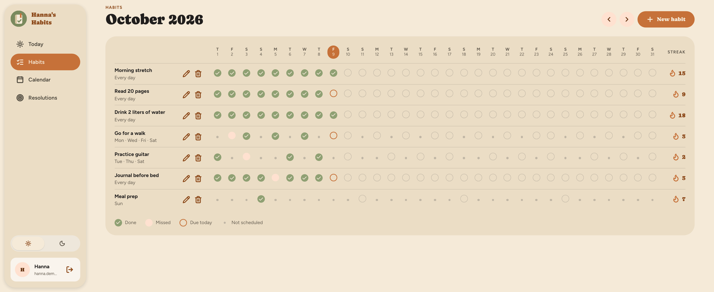
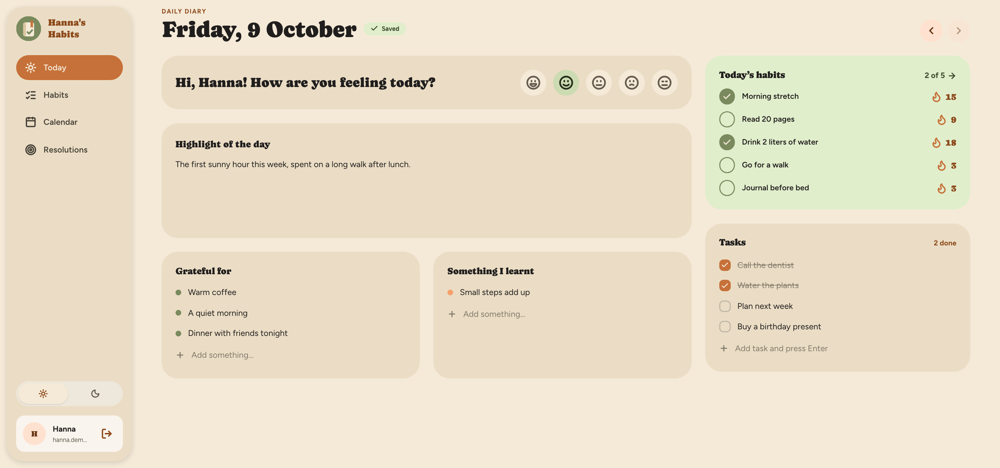
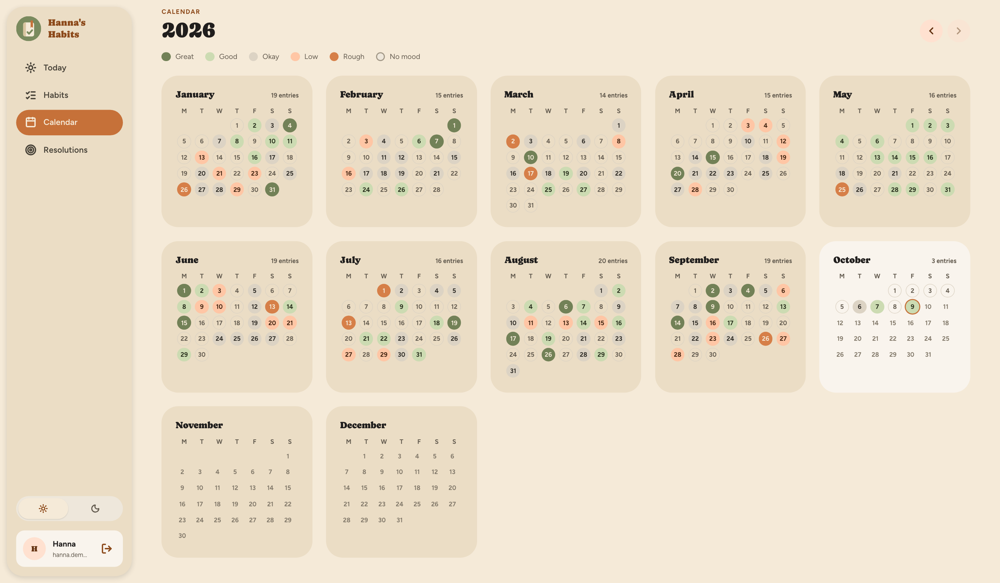
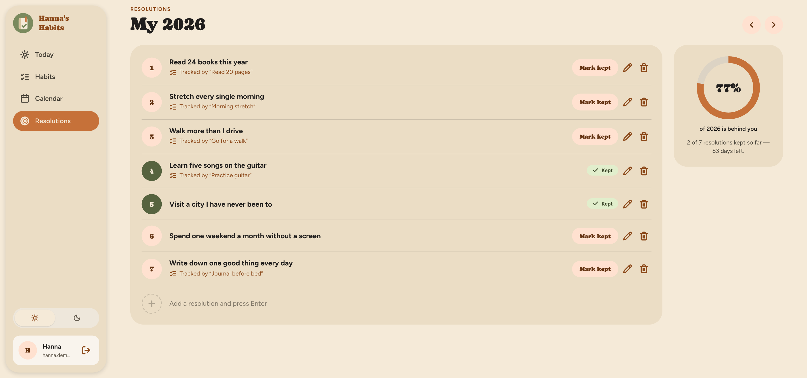
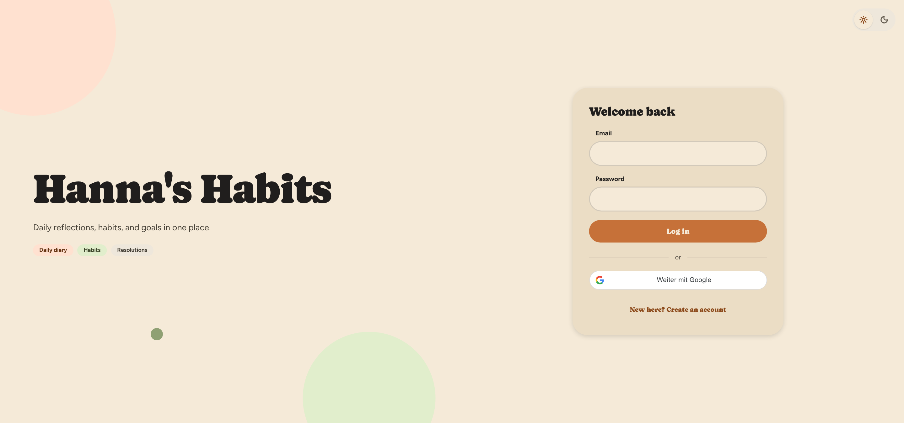
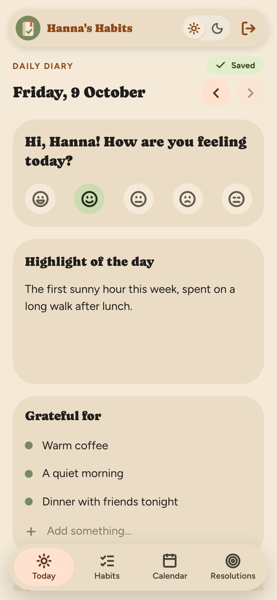
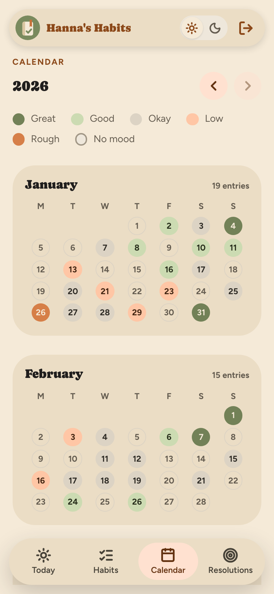
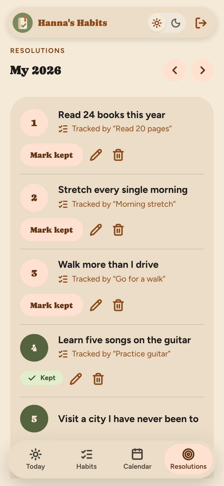

# Hanna's Habits 🧘‍♀️📓

A habit tracker with a daily diary, a year calendar and year resolutions. I started it for my wife, and it's also the project I use to learn how a real web app is put together, from the database to the screen.

I'm retraining as a software developer (Fachinformatiker für Anwendungsentwicklung).



## What it does

- **Habits.** A month grid. Tick a day, see the streak. Every habit has its own schedule, so a habit you only do on Monday, Wednesday and Friday isn't "broken" on Tuesday.
- **Daily diary.** One page per day: mood, a highlight, what I'm grateful for, something I learnt, and a task list. It saves while you type, there is no save button.
- **Calendar.** The whole year at a glance. Every day with an entry gets the colour of its mood, and a click opens that day.
- **Resolutions.** A list per year. You can mark one as kept, or link it to the habit that tracks it.
- Sign in with e-mail and password, or with Google. Light and dark theme. It works on a phone.

## Screenshots

These show demo data, not anyone's real diary.









On a phone the sidebar becomes a bar at the bottom:

<table>
  <tr>
    <td align="center"></td>
    <td align="center"></td>
    <td align="center"></td>
  </tr>
  <tr>
    <td align="center">Daily diary</td>
    <td align="center">Calendar</td>
    <td align="center">Resolutions</td>
  </tr>
</table>

## How it was built

I'd rather tell you this myself than have you find it in the commit history: most of the code in the current version was written together with Claude Code, an AI coding assistant from Anthropic. You'll see `Co-Authored-By: Claude` on the commits.

How that went, roughly:

The first version, a couple of years ago, was mine alone. I got stuck on the frontend and put the project down for a long time. In October 2026 I picked it up again with one goal: finish it. This time we started with a plan ([`docs/ROADMAP.md`](https://github.com/iseaman89/hannas-habits-server/blob/main/docs/ROADMAP.md) in the backend repo), worked through it in small steps, and kept a log of every step and why it was done that way ([`docs/PROGRESS.md`](https://github.com/iseaman89/hannas-habits-server/blob/main/docs/PROGRESS.md)).

What I decided: what the app does, what it leaves out, and the architecture. Clean Architecture, DDD and CQRS are in there on purpose, even though a habit tracker doesn't need that much structure. That's what a learning project is for. I asked Claude to give me a short reason whenever it used a pattern, and to say so when something was over-engineered.

What Claude did: a lot of the typing, for the code and for the tests. I check what comes out, and I'm the one who opens the app in the browser and says what's wrong.

I'm telling you this because it's true, and because I think working with an AI assistant is a skill of its own. Small steps, tests as a safety net, and understanding what I merge. I'm still learning that part too.

## Under the hood

The project is two repositories.

**Backend** ([hannas-habits-server](https://github.com/iseaman89/hannas-habits-server))
- ASP.NET Core 8, Entity Framework Core, PostgreSQL
- Four projects with the dependency rule pointing inwards (Domain, Application, Infrastructure, WebApi). The architecture tests fail the build if someone breaks it.
- Use cases with MediatR (one folder per command or query), validation with FluentValidation
- Sign-in with ASP.NET Identity, short-lived JWT access tokens and refresh tokens that rotate on every use. If an old refresh token is used again, all sessions of that user are revoked.
- About 800 tests: unit tests, handler tests with hand-written fakes instead of a mocking library, architecture tests, and integration tests against a real PostgreSQL in a Testcontainers container, including forced race conditions
- Docker Compose for the API and the database, GitHub Actions builds and tests every push

**Frontend** ([hannas-habits-ui](https://github.com/iseaman89/hannas-habits-ui))
- React 18, TypeScript (strict), Vite, Tailwind CSS 4
- TanStack Query for server state, React Hook Form with zod for forms, React Router
- The API types are generated from the backend's OpenAPI document, so changing an endpoint breaks the type check instead of breaking in the browser
- Its own small design system, built from a redesign mockup in Claude Design
- Over 900 tests with Vitest, and a Docker image served by nginx

## Run it yourself

Each repository has the full instructions. The short version:

```bash
# backend: API + PostgreSQL on http://localhost:8080
git clone https://github.com/iseaman89/hannas-habits-server.git
cd hannas-habits-server
cp .env.example .env        # fill in the values, the file explains each one
docker compose up --build

# frontend, in another terminal: http://localhost:5173
git clone https://github.com/iseaman89/hannas-habits-ui.git
cd hannas-habits-ui
cp .env.example .env        # point VITE_API_URL at the API
npm install
npm run dev
```

One thing that may trip you up: the API refuses to start without a Google OAuth client id, because Google sign-in checks the ID tokens against it. The id is public, not a secret, and the backend's `.env.example` says where it comes from.

## What's not there

- No password reset and no e-mail confirmation yet.
- The interface is in English only.
- If you keep a day open in two tabs or on two devices, the tab that saves last wins.

## What I practised

Keeping layers apart so the domain doesn't know about the database. Writing tests that check state instead of call sequences. Handling two requests that hit the same row at the same time. Token rotation and what a stolen refresh token looks like on the server. Generating types from an API contract. Getting a project to build and test on a machine that isn't mine (Docker and CI). And writing down why I did something, so I can still understand it a month later.

## About me

I'm **Yevgen Panych**, a career-changer in training as a Fachinformatiker AE in Bremen, Germany.

📫 [LinkedIn](https://www.linkedin.com/in/yevgen-panych)  
🐙 [GitHub](https://github.com/iseaman89)
